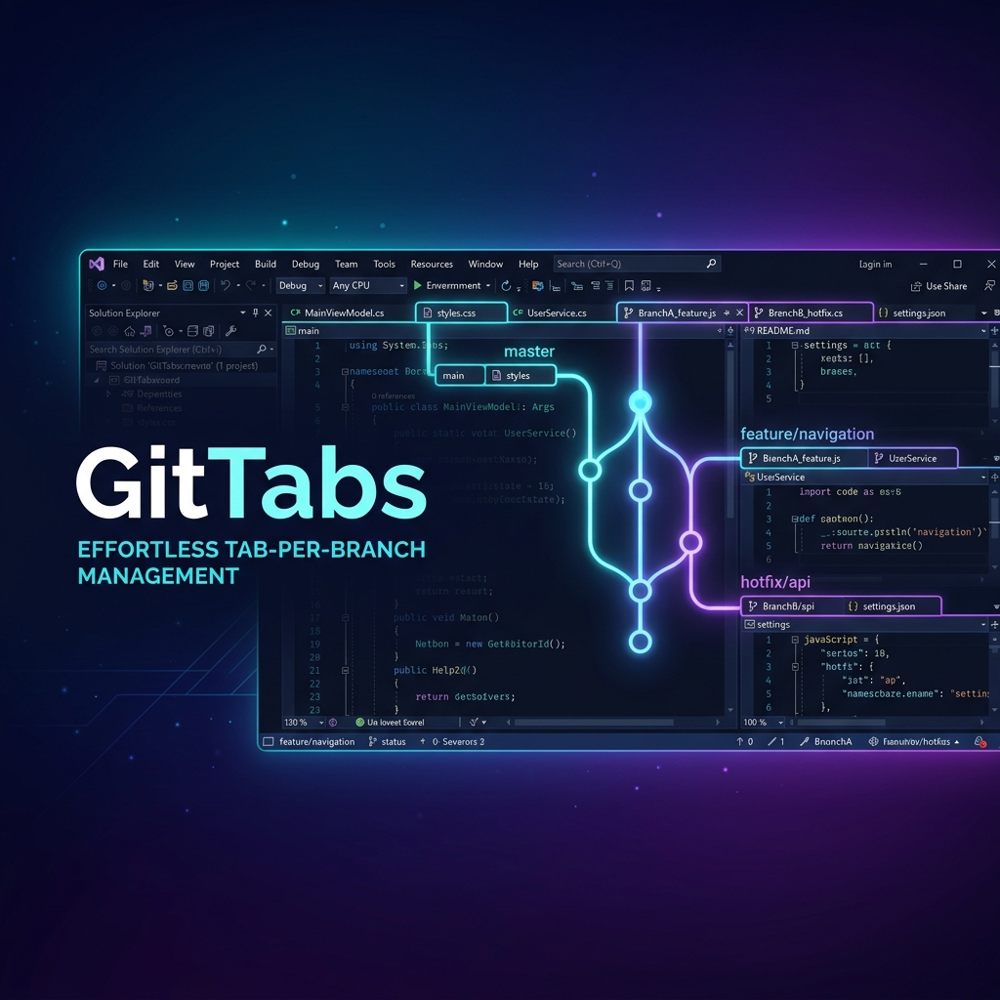
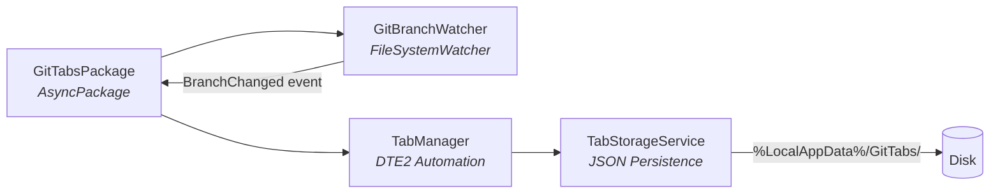

<p align="center">
  
</p>

<h1 align="center">GitTabs</h1>

<p align="center">
  <strong>Your tabs follow your branches.</strong><br/>
  A Visual Studio extension that automatically saves and restores open document tabs per git branch.
</p>

<p align="center">
  <a href="https://github.com/JonaHD345/GitTabs/releases"></a>
  <a href="LICENSE.txt"></a>
  
  
</p>

---

## 💡 The Problem

You're deep in `feature/auth`, twelve files open, perfectly arranged. You switch to `main` to review a PR — and now your tabs are gone. Switch back? Gone again. Every branch switch destroys your context.

**GitTabs fixes this.** It silently remembers which tabs belong to which branch and restores them instantly when you switch back.

---

## ✨ Features

| Feature | Description |
|---|---|
| 🔄 **Automatic Save & Restore** | Tabs are saved when you leave a branch and restored when you return — zero manual effort. |
| ⚡ **Zero Startup Impact** | Built as an `AsyncPackage` with background loading. VS starts just as fast as without the extension. |
| 🌿 **Git Worktree Support** | Works with standard repos and [git worktrees](https://git-scm.com/docs/git-worktree) alike. |
| 🔀 **Detached HEAD Support** | Even `git checkout <commit>` gets its own tab set (`detached-a1b2c3d4`). |
| 🆕 **Smart New Branch Behavior** | Switching to a branch with no history? Your current tabs stay open — because you probably want them. |
| 💾 **Per-Solution Isolation** | Tab state is scoped to each solution, so different projects never interfere. |
| 🛡️ **Graceful Degradation** | No git repo? The extension stays completely dormant. No errors, no overhead. |
| 📋 **Output Window Diagnostics** | A dedicated *GitTabs* output pane logs skipped files and errors for easy debugging. |

---

## 🚀 Getting Started

### Prerequisites

- **Visual Studio 2022** version **17.14** or later (amd64)
- A git-initialized repository

### Installation

1. Download the latest `.vsix` from [Releases](https://github.com/JonaHD345/GitTabs/releases).
2. Double-click the `.vsix` file to install.
3. Restart Visual Studio.

That's it. **No configuration required** — GitTabs starts working the moment you open a solution with a git repository.

---

## 🎬 How It Works

```
  ┌──────────────┐     switch branch      ┌──────────────┐
  │  feature/auth │ ──────────────────────► │    main      │
  │               │                        │               │
  │  Login.cs     │   ① Save tabs for     │  Program.cs   │
  │  AuthSvc.cs   │      feature/auth     │  README.md    │
  │  Token.cs     │                        │  CI.yml       │
  │  [active] ●   │   ② Restore tabs for  │  [active] ●   │
  └──────────────┘      main              └──────────────┘
```

1. **Branch switch detected** — GitTabs watches `.git/HEAD` with a `FileSystemWatcher` and 400ms debounce.
2. **Save** — All open document paths (and which tab was active) are persisted as JSON.
3. **Restore** — Previously saved tabs for the target branch are reopened, and the active tab is re-focused.

### Storage

Tab data is stored as lightweight JSON files in:

```
%LocalAppData%\GitTabs\<SolutionName>\<BranchName>.json
```

Example:

```
%LocalAppData%\GitTabs\MyApp\main.json
%LocalAppData%\GitTabs\MyApp\feature_auth.json
```

> [!NOTE]
> Branch names with special characters (e.g. `feature/auth`) are automatically sanitized for safe file names.

---

## 🏗️ Architecture

```
GitTabs/
├── GitTabsPackage.cs           # AsyncPackage entry point & lifecycle
├── Models/
│   └── TabInfo.cs              # TabInfo + BranchTabData data models
└── Services/
    ├── GitBranchWatcher.cs     # FileSystemWatcher on .git/HEAD
    ├── TabManager.cs           # DTE2-based tab save/restore logic
    └── TabStorageService.cs    # JSON file persistence in %LocalAppData%
```

### Component Overview



| Component | Responsibility |
|---|---|
| **GitTabsPackage** | Entry point. Handles VS lifecycle events (solution open/close), wires up services, orchestrates save/restore flow. |
| **GitBranchWatcher** | Monitors `.git/HEAD` for changes. Debounces events (400ms) to avoid noise from multi-step git operations. Supports worktrees. |
| **TabManager** | Reads open tabs via `DTE2.Documents`, opens/closes documents, manages the active tab focus. Writes diagnostics to the Output Window. |
| **TabStorageService** | Serializes `BranchTabData` to JSON and persists per-solution/per-branch. Async I/O with graceful error handling. |

---

## 🛠️ Building from Source

### Prerequisites

- Visual Studio 2022 (17.14+) with the **Visual Studio extension development** workload
- .NET Framework 4.7.2 targeting pack

### Build

```bash
# Clone the repository
git clone https://github.com/JonaHD345/GitTabs.git
cd GitTabs

# Build the solution
dotnet build GitTabs.slnx -c Release
```

The `.vsix` output will be in `GitTabs/bin/Release/`.

### Debug

1. Open `GitTabs.slnx` in Visual Studio.
2. Set **GitTabs** as the startup project.
3. Press **F5** — an experimental VS instance will launch with the extension loaded.

---

## 🧩 Technical Details

| Detail | Value |
|---|---|
| **Package Type** | `AsyncPackage` (background-loaded) |
| **Auto-Load Trigger** | `SolutionExistsAndFullyLoaded` |
| **Git Detection** | File system walk from solution dir upward |
| **Branch Detection** | `.git/HEAD` file parsing |
| **Change Detection** | `FileSystemWatcher` + 400ms debounce timer |
| **Serialization** | Newtonsoft.Json (`Formatting.Indented`) |
| **I/O Model** | Async `FileStream` (4096 byte buffer) |
| **Thread Safety** | `JoinableTaskFactory` for UI thread marshaling |

---

## 🤝 Contributing

Contributions are welcome! Here's how to get started:

1. **Fork** the repository
2. **Create** a feature branch (`git checkout -b feature/amazing-feature`)
3. **Commit** your changes (`git commit -m 'feat: add amazing feature'`)
4. **Push** to the branch (`git push origin feature/amazing-feature`)
5. **Open** a Pull Request

> Check the [Issues](https://github.com/JonaHD345/GitTabs/issues) tab for ideas on what to work on.

---

## 📜 License

This project is licensed under the **MIT License** — see the [LICENSE.txt](LICENSE.txt) file for details.

---

<p align="center">
  <sub>Built with ❤️ for developers who switch branches a lot.</sub>
</p>
